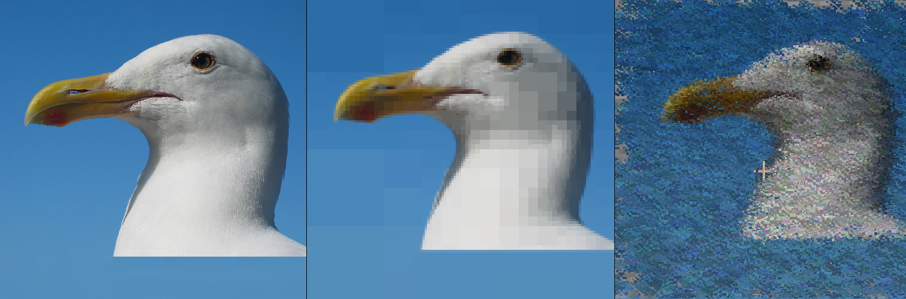

# Minecraft Image Compressor

Minecraft Image Compressor is a tool for compressing images and converting them to Minecraft particle effects.
version: 0.1.0

## Installation

1. Download the latest release of the Minecraft Image Compressor from the GitHub repository.
2. Install the required dependencies by running `pip install -r requirements.txt`.
3. Install Minecraft if you haven't already.

## Usage

1. Rename the image you want to process as `image.png` (the image must have binary number of pixels on each side (2, 4 ... 256, 512, 1024, 2048...)) and put it inside the main folder.
2. Run `python compression_algorithm.py` to create the `output.png` preview and the `result.mcfunction` file that contains all the commands.
3. Move the `result.mcfunction` file inside your datapack and use it as a normal function.
4. Run `/function [namespace]:result` at your desired location.

## Configuration

You can configure the output particle effect by modifying the `config.py` file. The following options are available:

##### Particles configuration

- size: the size of the "dust" particle to use (default: `1`)
- count: the number of particles in 1 place, can be used to control the opacity (default: `1`)
- type: the type of all particles, can be choosen between force/normal (default: `force`)

##### Placement configuration

- spacing: the spacing of the particles, will affect the size of the final particle art (default: 0.01)
- orientation: the rotation of the final particleart in the world

##### Compression configuration

- color compression: the minimal difference that forces the algorithm to split the selection (default: 40)
- minimal pixel size: if the algorithm makes this small squares it stops and does not continue (default: 4)

# Showcase

Following images will show you how this looks in-game:

# Planed Features
- GUI
- more algorithms to choose from
- more customization
- evolution generation optimalization

# Algorithm used

This algorithm employs a quadratic approach to reduce the size of images. Initially, it divides the image into selections, each the size of a quarter of the original image. If the subsequent square is uniform in color or at least similar in color within the specified color similarity value, the division process stops, and it is recorded in the output file. This cycle repeats until all squares are either divided or become as small as the minimum size. Then, the algorithm terminates the division process and sets the average color value throughout.
The algorithm has a distinct advantage in that it preserves sharp color transitions while removing unnecessary details. However, it has a disadvantage in that it often results in visible square fragments that can appear visually unappealing.

# Credits

Minecraft Image Compressor was created by Lena_hal and is available under the MIT license. The tool uses the following libraries:

- OpenCV
- NumPy
- Pandas

# Disclaimer

Minecraft is a trademark of Mojang AB. This tool is not affiliated with or endorsed by Mojang AB. Use at your own risk.
